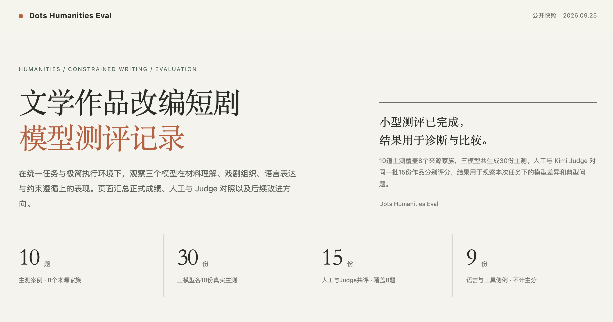

# Dots-Humanities-Eval

自建小型测试集，可对多个模型进行文学作品改编AI短剧剧本任务的自动化测评。

## 结果示例

| 模型 | Judge 均分 /100 | 人工均分 /100 | 合格数（Judge / 人工） |
|---|---:|---:|---:|
| MiMo-V2.6-Pro | 86.00 | 73.50 | 4/5 / 2/5 |
| Dots3-note-prev | 83.30 | 70.80 | 1/5 / 1/5 |
| Qwen3.8-27B | 77.00 | 68.00 | 3/5 / 1/5 |

总分为 <code>S = H + 7.5F + 7.5D + 5L</code>，人类专家与 Judge 模型分开报告。每个模型抽评不同的 5 份作品。注意，测评示例中的样本量和题目组合都不足以形成稳定排名，自动评分与人工评分仍存在差异。详见 [测评报告](REPORT.md)。

## 文件入口

- [交互式报告](index.html)
- [复用流程说明](runbook/RUNBOOK.md)
- [机器可读复算数据](analysis.json)
- [SFT数据](sources/sft)

## 离线测试

需要 Python 3.11 及以上；不需凭据、Docker 或网络。测试代码与运行环境位于 `runbook/`：

~~~bash
cd runbook
export TMPDIR="$PWD/.work/tmp" PYTHONDONTWRITEBYTECODE=1
mkdir -p "$TMPDIR"
python3 -m unittest -q test_eval.py
~~~

运行代码与流程见 [runbook/](runbook/)，冻结数据、实测记录和原生成源码见 [sources/](sources/)。代码许可不自动覆盖第三方原文。新实验应遵循复用流程中的数据、运行授权及费用边界。

## 来源与使用声明

本仓库涉及的文学作品仅用于非商业的研究与测评演示；著作权归原作者与译者所有。
